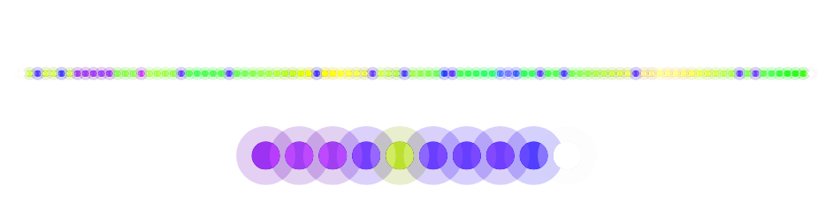

# GlitchGlimmer

Sound-reactive LED firmware for an ESP32. An I2S microphone feeds an FFT, the
spectrum drives a mood classifier, and the mood picks a scene. Each scene is a
base animation plus reactive layers that fade in over it. Two LED strips run
independently, and a small TFT shows the current scene, mood and levels.

## Status

Both build environments are green and the host harness passes 200 checks. The
firmware **has not been run on hardware**. Everything below the build is
verified by simulation and by reading the code, not by watching a strip.

Three known gaps are worth stating up front rather than discovering later:

- The classifier's structural moods (`Silent`, `Tease`, `Buildup`, `Descent`,
  `DROP`, `Weeeird`) are detected, but no scene is tagged for one, so
  `pickSceneByMood`'s structural branch is still empty and all six fall through
  to the intensity axis. Their thresholds are also untuned against any
  recording. `_architecture/TODO.md` carries it.
- Seven more macros in `src/config/Config.h` have no call sites
  (`CHANNEL_COUNT`, `BITS_PER_SAMPLE`, `FFT_BANDS`, `FFT_MAX_SCALE`,
  `BAR_HEIGHT_MAX`, `MIN_SWITCH_INTERVAL`, `ENABLE_WEB_UI`). Five of the same
  kind were deleted, along with the `GAIN_SMOOTHING` that declared `0.92f`
  against the `0.85f` that ran. These seven stay by decision: none traces to a
  caller or to a commit that removed one, so each is the only record of an
  intent that may still be wanted, and they go only once that intent is known.
- The mood arc has never been observed on real audio. The only capture is 2.3
  seconds long, shorter than the classifier's hold and confirmation windows, so
  it can show that a value moves but not that it settles. Tuning waits on a
  longer recording.

## Hardware

| Part | Wiring |
|---|---|
| ESP32 board | ESP32-S3 DevKitC-1 |
| TFT | ST7789V 240x135, SPI on MOSI 19, SCLK 18, CS 5, DC 16, RST 23, backlight 4 |
| I2S microphone | INMP441, WS 26, SCK 27, SD 32 |
| LED strip 0 | WS2812B on GPIO 4, 100 pixels |
| LED strip 1 | WS2812B on GPIO 33, 10 pixels |
| Encoder | A 39, B 38, button 17 |
| Buttons | 0 and 35 |

Pins and counts live in `src/config/Config.h`. The display is configured in
`include/tft_setup.h`.

## Build

PlatformIO is the build system. Neither command below needs a board attached,
since no environment sets `upload_port` and only `-t upload` opens a port.

```
pio run                      # the firmware, via default_envs
pio run -e esp32s3           # the same thing, spelled out
pio run -e esp32s3 -t upload # needs the board connected
```

The device environment compiles at `-std=gnu++11`, which is what catches any
C++17 or newer construct reaching device-reachable code. Current size is RAM
8.9 percent and flash 33.4 percent.

## Tests

`src/sim_main.cpp` is a host harness. It compiles the real `LEDStripController`,
`SceneDirector`, `LayerManager`, `SceneRegistry` and every layer against a stub
Arduino core in `sim/stubs/`, then drives them over a clock the harness owns and
asserts on the result. It needs a host C++ compiler on `PATH` and nothing else.

On Linux that is already true. On Windows it is the one thing that is not
installed for you, since PlatformIO ships a cross-compiler for the device
environment but not a host one. Any 64-bit mingw-w64 `g++` works, from MSYS2 or
from `winget install BrechtSanders.WinLibs.POSIX.UCRT`. Put its `bin` on `PATH`
and the command below works unchanged. Leave it there for the Visualisation
steps as well: the binary needs the same DLLs to run that it needed to link,
and without them it exits with no output rather than an error.

```
pio run -e native -t exec
```

200 checks cover the scene and layer lifecycle over 3000 frames, a sweep of all
eight catalog animations at two strip lengths, every reachable layer factory,
device-scale audio with a populated spectrum and waveform, the mood partition
over 800 level-and-tempo inputs and 10201 more with the dynamics nudge live, the
structural detectors against signals that do not have their shape, and a soak of
the float phase accumulators for 20000 frames each.

One thing the harness cannot see: `sim/stubs/Arduino.h` aliases `String` to
`std::string`, whose small-string optimisation hides the per-frame churn the
device pays. Allocation counts from the harness exclude it.

## Visualisation

`web/` has two views over one canvas, and neither is a JavaScript rewrite. Both
run the firmware's own code, so what you see cannot drift from what the device
would do.

`dist/` is the complete, committed demo bundle. It contains the static page,
recorded frames, and the WebAssembly module, so a fresh clone can run the demo
without first installing PlatformIO or Emscripten.

| View | Driven by | Needs |
|---|---|---|
| Recording | Frames the harness writes with `--dump-frames` | `dist/data/`, committed bundle |
| Live microphone | `src/` compiled to WebAssembly and stepped once per frame | `dist/live/glitchglimmer.wasm`, committed bundle, plus a microphone |

The recording view replays a fixed audio timeline and runs no FFT. The live view
hands the microphone's samples to `AudioProcessor` unchanged, so the FFT, the
feature extraction, the beat detector and the mood classifier are all the
firmware's.



### Run it

Node is the only requirement, and there is nothing to install.

```
npm start
```

Then open `http://127.0.0.1:8000`. The server uses committed `dist/` when it is
available. A specific moment can be linked directly with
`?scenario=device&frame=500&paused=1`. Pass a port with `npm start -- 8080`.

### Rebuilding the demo bundle

The generated bundle is committed and Pages deploys it directly. Contributors
with the project toolchains can refresh it with:

```
npm run build:dist
```

This command first builds the native PlatformIO harness (`pio run -e native`),
then runs that executable to write `web/data/`, builds the pinned Emscripten
module into `web/live/`, and finally copies the complete page to `dist/`.
It does not call `npm run native` because that command also executes the
harness's test mode; frame generation needs to invoke the executable with its
`--dump-frames` arguments instead.

The tracked `.githooks/pre-push` hook runs this command before every push and
stops the push if `dist/` changed. Install it once with `npm run setup:hooks`.

### Live view

The Live microphone button needs the WebAssembly module. Sourcing `emsdk_env.sh`
is the one part a script cannot do, so run this from a shell where Emscripten is
on `PATH`.

```
source /path/to/emsdk/emsdk_env.sh
npm run wasm -- --watch      # rebuild on save
```

Leave that running while editing an animation. The page polls
`web/live/build.json` and reloads itself when a build lands, so the loop is edit,
save, look at the page. Until the script has run once the module is missing and
the live view 404s.

### The server

`npm start` runs `tools/serve-web.js`, a static server for `web/` with no
dependencies, which is why it works on a bare clone with nothing installed but
Node. It is not interchangeable with a plain file server, for two reasons. The
module has to be served as `application/wasm` to be stream-compiled, and nothing
under `web/` may be cached, because `build-wasm.sh` replaces the module and the
recordings under paths that are already in the browser's cache. A cached copy of
the module is indistinguishable from a rebuild that did not take.

`python -m http.server 8000 --directory web` also works, and will serve you a
stale module after a rebuild, because it answers conditional requests.

`.github/workflows/pages.yml` publishes committed `dist/` on every push to
`main`. It does not rebuild the native harness or WebAssembly; the pre-push hook
keeps the bundle synchronized before it can be pushed. Pages must be enabled in
Settings → Pages → Source → GitHub Actions.

## Layout

| Path | Contents |
|---|---|
| `src/` | Firmware. `main.ino` holds `setup()` and `loop()`, `sim_main.cpp` is the host harness |
| `src/audio/` | I2S capture, FFT, feature extraction, history rings |
| `src/scenes/` | Scene registry and director, mood history, layer manager and pool |
| `src/animations/` | Catalog base animations |
| `src/animations/visual-layers/` | Compositor layer classes |
| `src/display/` | TFT layout, widgets and themes |
| `include/` | `tft_setup.h`, the TFT_eSPI display configuration |
| `sim/stubs/` | Arduino core stubs used only by the host build |
| `tools/` | `build-wasm.sh` for the browser module, `serve-web.js` and `dump-frames.js` behind `npm run` |
| `web/` | The two views, `web/data/` and `web/live/` both generated |
| `AGENTS.md` | Stack rules and conventions for this repo, for contributors and agents alike |
| `_architecture/` | Working notes. `TODO.md` is the live set, `BACKLOG.md` is unscheduled work, `ARCHITECTURE.md` is why the repo is shaped this way, `plans/` holds the audit and the fix plan |

## Where to start reading

`_architecture/ARCHITECTURE.md` is the shortest route into why the code is shaped
the way it is, and it carries the reasoning behind the parts that look like
tuning constants. `_architecture/TODO.md` is where the work stands now.
`_architecture/BACKLOG.md` lists what is known broken or unmeasured. The two
files in `_architecture/plans/` are the defect audit and the plan that fixed it.

The scene pipeline is worth reading in this order: `src/audio/AudioProcessor.cpp`
produces `AudioFeatures`, `src/scenes/MoodHistory.h` classifies a mood from it,
`src/scenes/SceneRegistry.cpp` maps mood to a scene, and
`src/scenes/LayerManager.cpp` composites the result.
